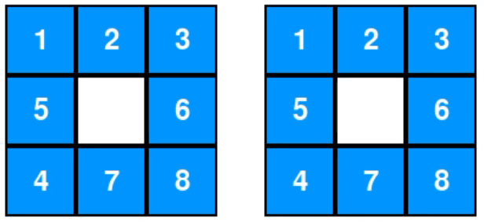

# Áp dụng các thuật toán tìm kiếm và tối ưu để giải bài toán 8 puzzle

Dự án này thể hiện các thuật toán tìm kiếm được sử dụng trong Trí tuệ Nhân tạo, bao gồm Tìm kiếm không có thông tin (Uninformed Search), Tìm kiếm có thông tin (Informed Search), Tìm kiếm cục bộ (Local Search), Tìm kiếm trong môi trường phức tạp (Complex Environments), Tìm kiếm có ràng buộc (CSPs), và Học tăng cường (Reinforcement Learning - Đang trong quá trình hoàn thiện). Mỗi phần bao gồm các hình ảnh trực quan (GIF) và biểu đồ hiệu suất để giúp hiểu rõ hành vi của các thuật toán, trong điều kiện môi trường tĩnh và xác định của trò chơi 8 puzzle.

## Cấu trúc Thư mục

- `__pycache__`: Thư mục chứa các file bộ nhớ đệm của Python (tự động tạo).
- `assets/`: Chứa các file GIF và biểu đồ để trực quan hóa.
- `logic.py`: Chứa mã nguồn chính để triển khai các thuật toán tìm kiếm.
- `visualization.py`: Xử lý giao diện.
- `results.csv`: Kết quả đầu ra từ việc chạy các thuật toán.

## Tìm kiếm không có thông tin (Uninformed Search)

Uninformed Search bao gồm các thuật toán như BFS, DFS, UCS, và IDDFS. Dưới đây là các hình ảnh trực quan cho từng thuật toán, cùng với biểu đồ hiệu suất.

### Hình ảnh Trực quan

| Tên thuật toán | Hình ảnh                                |
| -------------- | --------------------------------------- |
| BFS            |                 |
| DFS            |    |
| UCS            |    |
| IDDFS          |  |

| Tên thuật toán | Hình ảnh                                |
| -------------- | --------------------------------------- |
| BFS            |                   |
| DFS            |    |
| UCS            |    |
| IDDFS          |  |

### Hình ảnh Trực quan

|                                        |  |
| ------------------------------------------------------------ | ------------------------------------------------------------ |
|  |  |

### Biểu đồ Hiệu suất


### Phân tích

[Thêm phần phân tích của bạn về Tìm kiếm Không Thông Tin tại đây.]

## Tìm kiếm Có Thông Tin

Tìm kiếm Có Thông Tin bao gồm các thuật toán như A\*, Tìm kiếm Tốt Nhất Trước Hết theo Heuristic, và một phương pháp dựa trên heuristic khác. Dưới đây là các hình ảnh trực quan và biểu đồ hiệu suất.

### Hình ảnh Trực quan

|  |  |  |
| -------------------------------------------------------- | -------------------------------------------------------- | -------------------------------------------------------- |

### Biểu đồ Hiệu suất


### Phân tích

[Thêm phần phân tích của bạn về Tìm kiếm Có Thông Tin tại đây.]

## Tìm kiếm Cục Bộ

Tìm kiếm Cục Bộ bao gồm các thuật toán như Leo Đồi (Hill Climbing), Ủ Nhiệt Mô Phỏng (Simulated Annealing), Thuật toán Di truyền (Genetic Algorithms), và các thuật toán khác. Dưới đây là các hình ảnh trực quan và biểu đồ hiệu suất.

### Hình ảnh Trực quan

|  |  |  |
| ----------------------------------------------- | ----------------------------------------------- | ----------------------------------------------- |
|  |  |  |

### Biểu đồ Hiệu suất


### Phân tích

[Thêm phần phân tích của bạn về Tìm kiếm Cục Bộ tại đây.]

## Tìm kiếm Phức Tạp

Tìm kiếm Phức Tạp bao gồm ba thuật toán nâng cao cùng với các hình ảnh trực quan và biểu đồ hiệu suất.

### Hình ảnh Trực quan

|  |  |  |
| --------------------------------------------------- | --------------------------------------------------- | --------------------------------------------------- |

### Biểu đồ Hiệu suất


### Phân tích

[Thêm phần phân tích của bạn về Tìm kiếm Phức Tạp tại đây.]

## Bài toán Hài Hòa Ràng Buộc (CSPs)

CSPs bao gồm các thuật toán như Quay lui (Backtracking), Kiểm tra Tính Hài Hòa Cung (Arc Consistency), và một phương pháp CSP khác. Dưới đây là các hình ảnh trực quan và biểu đồ hiệu suất.

### Hình ảnh Trực quan

|  |  |  |
| -------------------------- | -------------------------- | -------------------------- |

### Biểu đồ Hiệu suất


### Phân tích

[Thêm phần phân tích của bạn về CSPs tại đây.]

## Học Tăng Cường

Phần này hiện đang trong quá trình phát triển.

### Hình ảnh Trực quan

[Chưa có nội dung.]

### Biểu đồ Hiệu suất

[Chưa có nội dung.]

### Phân tích

[Thêm phần phân tích của bạn về Học Tăng Cường tại đây.]

## Hướng dẫn Cài đặt và Sử dụng

### Yêu cầu Cần Thiết

- Python 3.8 hoặc cao hơn
- pip (trình quản lý gói của Python)

### Các Bước Cài đặt

1. Tải mã nguồn về máy:
   ```bash
   git clone https://github.com/ten-nguoi-dung/ten-kho-luu.git
   cd ten-kho-luu
   ```
2. Tạo môi trường ảo (khuyến khích nhưng không bắt buộc):
   ```bash
   python -m venv venv
   source venv/bin/activate  # Trên Windows: venv\Scripts\activate
   ```
3. Cài đặt các thư viện cần thiết:
   ```bash
   pip install -r requirements.txt
   ```
   _Lưu ý_: Nếu không có file `requirements.txt`, bạn có thể cần cài đặt thủ công các thư viện như `pandas`, `matplotlib`, và các thư viện khác được sử dụng trong dự án.

### Chạy Dự án

1. Chạy file trực quan hóa chính:
   ```bash
   python visualization.py
   ```
2. File sẽ tạo ra các GIF và biểu đồ trong thư mục `assets/` và lưu kết quả vào `results.csv`.

### Tùy chỉnh Dữ liệu

- Sửa file `data.csv` để thay đổi dữ liệu đầu vào cho các thuật toán.
- Cập nhật file `logic.py` để điều chỉnh cách triển khai thuật toán nếu cần.

## Đóng góp

Chúng tôi hoan nghênh mọi đóng góp! Vui lòng làm theo các bước sau:

1. Fork kho lưu trữ.
2. Tạo một nhánh mới (`git checkout -b feature/tinh-nang-cua-ban`).
3. Thực hiện thay đổi và commit (`git commit -m "Thêm mô tả thay đổi"`).
4. Đẩy lên nhánh của bạn (`git push origin feature/tinh-nang-cua-ban`).
5. Mở một Pull Request.

## Liên hệ

Nếu có câu hỏi hoặc phản hồi, vui lòng liên hệ qua [email-cua-ban@example.com](mailto:email-cua-ban@example.com) hoặc mở một issue trên GitHub.
